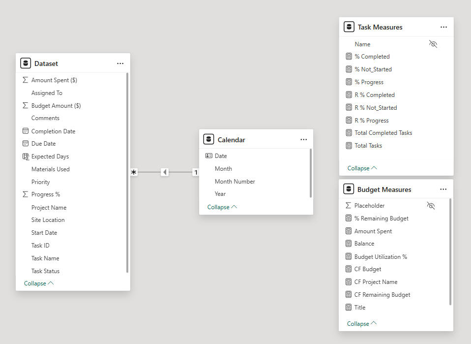

<h1 align="center">Skyline Construction Project Tracker</h1>

<a href="https://www.youtube.com/watch?v=dQw4w9WgXcQ"></a>

<p align="center">
  
</p>

In today's fast-paced construction industry, effective project monitoring and financial oversight are vital for ensuring the timely and cost-efficient execution of operations. Skyline Construction is actively advancing its capabilities in data analytics and visualization to meet the dynamic needs of its executive leadership and operations teams. With multiple large-scale projects underway—including residential, commercial, and industrial sites—real-time visibility into task progress and financial performance is paramount.

To support informed decision-making and promote transparency, the organization is leveraging interactive visual dashboards to track task statuses, team productivity, resource allocation, and budget utilization. These dashboards are crucial not only for operational reviews but also for strategic discussions at the executive level, enabling quick identification of bottlenecks and financial risks across the project portfolio.

<a href="https://www.youtube.com/watch?v=dQw4w9WgXcQ"></a>

<p align="center">
  
</p>

The primary objective of this initiative is to develop a suite of comprehensive and interactive visual dashboards that:

- Track the progress of ongoing tasks categorized by status (“Not Started,” “In Progress,” “Completed,” and “Blocked”) across all projects.
- Enable detailed filtering by team member and time period to allow granular progress evaluation.
- Provide financial visualizations highlighting Total Budget vs. Amount Spent, Budget Utilization Percentages, and Cumulative Spending Trends.
- Offer executive-friendly insights into task efficiency, bottleneck identification, and budget performance for better strategic planning and resource allocation.

<a href="https://www.youtube.com/watch?v=dQw4w9WgXcQ"></a>

<p align="center">
  
</p>

Skyline Construction is currently facing challenges in presenting unified, real-time insights on project progress and budget utilization to its executive stakeholders. The existing reporting mechanisms lack the visual clarity and interactive filtering required for in-depth performance analysis and decision-making.

Key issues identified include:
- Inability to monitor task-level progress by team member or date range across multiple projects.
- Difficulty in identifying project bottlenecks and status discrepancies at a glance.
- Lack of visibility into budget overspending or underutilization across tasks and projects.
- Absence of cumulative analysis on financial performance trends over time.

To address these gaps, there is an immediate need for a robust data-driven visualization system that supports project control and financial governance while enhancing transparency and operational efficiency.

<a href="https://www.youtube.com/watch?v=dQw4w9WgXcQ"></a>

<p align="center">
  
</p>

This repository contains a structured dataset focused on **project management** within the **construction industry**. The data is formatted as a CSV file and is designed to support various analytical and reporting tasks.

### 📊 Data Overview

Each row in the dataset represents a specific **task** in a construction project. The data captures essential information including task details, responsible personnel, task status, schedule, resource usage, and budgeting.

### 🧾 Columns Included

The dataset comprises the following columns:

- **Project ID**: Unique identifier for the project  
- **Project Task ID**: Unique identifier for the task within a project  
- **Task Name**: Description or title of the task  
- **Assigned To**: The individual responsible for completing the task  
- **Task Status**: Current status of the task (e.g., *In Progress*, *Completed*, *Blocked*, *Not Started*)  
- **Priority**: Task priority level (*High*, *Medium*, *Low*)  
- **Start Date**: Date when the task was initiated  
- **Due Date**: Deadline for task completion  
- **Progress %**: Percentage of task completion  
- **Materials Used**: List of materials utilized for the task  
- **Site Location**: Location of the construction site  
- **Budget Amount**: Financial allocation for the task

<a href="https://www.youtube.com/watch?v=dQw4w9WgXcQ"></a>

<p align="center">
  
</p>

---

<p align="center">
  
</p>

---

### **Description of the Data Model**

The visual represents a data model built in **Power BI**, designed for tracking project tasks and budgets over time. It consists of four main tables—**Dataset**, **Calendar**, **Task Measures**, and **Budget Measures**—each serving a specific role in data analysis and reporting.

#### **1. Dataset Table**
The `Dataset` table acts as the **primary fact table** containing detailed records of project tasks and financials. It includes:

- **Task Details**: such as `Task ID`, `Task Name`, `Assigned To`, `Task Status`, `Priority`, and `Comments`.
- **Project Information**: including `Project Name` and `Site Location`.
- **Date Fields**: such as `Start Date`, `Due Date`, and `Completion Date` to track timelines.
- **Progress Tracking**: through fields like `Progress %`, `Expected Days`, and `Materials Used`.
- **Financial Fields**: such as `Budget Amount ($)` and `Amount Spent ($)` to monitor resource allocation.

#### **2. Calendar Table**
The `Calendar` table functions as a **date dimension table** to enable time-based analysis. It provides:

- Granular date-related attributes such as `Date`, `Month`, `Month Number`, and `Year`.
- A **one-to-many relationship** is established from the `Calendar` table to the `Dataset` table using the `Date` field, supporting efficient time intelligence calculations like monthly trends and year-to-date progress.

#### **3. Task Measures Table**
This table holds **calculated measures (KPIs)** related to task progress and completion. It includes:

- Percentages like `% Completed`, `% Not Started`, and `% Progress`.
- Relative progress metrics: `R % Completed`, `R % Not Started`, and `R % Progress`.
- Aggregates: `Total Completed Tasks` and `Total Tasks`.

These measures help in visualizing how tasks are progressing and identifying bottlenecks.

#### **4. Budget Measures Table**
This table provides **budget-related KPIs** and calculations, helping stakeholders manage financial performance. It includes:

- Financial metrics like `Amount Spent`, `Balance`, and `% Remaining Budget`.
- Budget utilization fields: `Budget Utilization %`, `CF Budget`, and `CF Remaining Budget`.
- Other descriptors: `CF Project Name`, `Title`, and `Placeholder`.

These fields enable effective monitoring of budget consumption and balance for various projects.

---

### **Purpose of the Model**
This data model is structured to support **project management dashboards** in Power BI, allowing users to:

- Track task progress and completion status.
- Analyze project budgets and expenditures.
- Generate time-based performance reports using the calendar dimension.
- Derive insights from both actual values and calculated measures using DAX.

<a href="https://www.youtube.com/watch?v=dQw4w9WgXcQ"></a>

<p align="center">
  
</p>

## 📅 Custom Table: 

#### 1. Calendar

```
Calendar = ADDCOLUMNS(CALENDARAUTO(), "Year", YEAR([Date]), "Month", FORMAT([Date], "mmm"), "Month Number", MONTH([Date]))
```
**📌 Description:**
This DAX formula creates a dynamic calendar table using CALENDARAUTO(), which automatically detects the date range from the data model. It enriches the table with additional columns:
- Year – Extracts the year from each date.
- Month – Extracts the short month name (e.g., Jan, Feb).
- Month Number – Provides the month as a number (1 to 12).
The calendar table is essential for implementing time intelligence functions such as filtering, grouping, and time-based calculations (YTD, MTD, QTD, etc.).

#### 2. Task Measures

```
Task Measures = DATATABLE("Name", STRING, {{"Measure Placeholder"}})
```
**📌 Description:**
This DAX formula creates a placeholder table named Task Measures, which acts as a container for storing all task-related DAX measures.
- DATATABLE creates a static table with a single column Name and one dummy row "Measure Placeholder".
- The placeholder row can be deleted later; the table's sole purpose is to group related measures like % Completed, % In Progress, % Not Started, etc.
- Helps maintain clean data modeling and improves readability by organizing all task KPIs in one dedicated table.
- Useful for dashboards that focus on project tracking, task lifecycle, and performance metrics.

#### 3. Budget Measures

```
Budget Measures = DATATABLE("Name", STRING, {{"Measure Placeholder"}})
```
**📌 Description:**
This DAX formula sets up a dedicated table called Budget Measures, which is used solely to house budget-related DAX measures.
- Like the Task Measures table, it uses a dummy row with DATATABLE and column "Name", which can be removed once actual measures are created.
- It becomes a centralized location for all KPIs related to budget analysis such as:
  - Total Budget
  - Amount Spent
  - Balance
  - Budget Utilization %
  - % Remaining Budget
- Enables clean model organization and intuitive grouping for use in finance dashboards, budget vs actual visuals, and resource planning reports.

---

## 📐 Calculated Column:

#### 1. Expected Days

```
Expected Days = DATEDIFF('Dataset'[Start Date], 'Dataset'[Due Date], DAY)
```
**📌 Description:**
This column calculates the number of days between the Start Date and the Due Date. It helps in understanding the expected duration for tasks, tracking deadlines, and managing service-level agreements (SLAs).

---

## 📏 Measures:

### A. Task Measures

#### 1. Total Tasks

```
Total Tasks = COUNTROWS(FILTER('Dataset', NOT ISBLANK('Dataset'[Task ID])))
```
**📌 Description:**
Counts only those tasks where the Task ID is not blank. This avoids inflating the task count due to incomplete or missing entries and provides a more accurate KPI for actual tasks in progress or completed.

#### 2. % Completed

```
% Completed = DIVIDE(CALCULATE([Total Tasks], 'Dataset'[Comments] = "No Issues"), [Total Tasks])
```
**📌 Description:**
Calculates the percentage of tasks with "No Issues" in the Comments column — representing completed or issue-free tasks.
- Uses CALCULATE to filter only such tasks.
- Uses DIVIDE to safely handle division by zero.

#### 3. R % Completed

```
R % Completed = 1.0 - [% Completed]
```
**📌 Description:**
Represents the remaining (or incomplete) portion of tasks — a simple complement to % Completed. Useful for:
- Highlighting pending workload
- Creating progress vs. backlog visuals
- Adding context to completion KPIs

#### 4. % Not_Started

```
% Not_Started = DIVIDE(CALCULATE([Total Tasks], 'Dataset'[Comments] = "not Started"), [Total Tasks])
```
**📌 Description:**
Calculates the percentage of tasks where Comments = "not Started", giving visibility into how much of the project is yet to begin.
- Helps identify bottlenecks or areas lacking kickoff
- Useful for resource planning and task delegation

#### 5. R % Not_Started

```
R % Not_Started = 1.0 - [% Not_Started]
```
**📌 Description:**
Calculates the complement of not started tasks, i.e., tasks that are either in progress or completed. This is especially helpful for:
- Visualizing progress vs. pending side-by-side
- Creating dual indicators (e.g., pie chart: Started vs. Not Started)

#### 6. % Progress

```
% Progress = DIVIDE(CALCULATE([Total Tasks], 'Dataset'[Comments] = "In Progress"), [Total Tasks])
```
**📌 Description:**
Calculates the percentage of tasks currently in progress based on the Comments column.
- Gives a real-time view of work actively being done
- Complements % Completed and % Not_Started for full project visibility
- Enables dynamic progress tracking across teams or milestones

#### 7. R % Progress

```
R % Progress = 1.0 - [% Progress]
```
**📌 Description:**
Calculates the remaining portion of tasks that are not in progress, offering a complementary view to % Progress.
- Useful for identifying idle or completed work
- Can be used in dual-indicator visuals (like progress vs. pending)
- Helpful for conditional formatting to highlight workflow imbalances

#### 8. Total Completed Tasks

```
Total Completed Tasks = CALCULATE([Total Tasks], 'Dataset'[Progress %] = 1.0)
```
**📌 Description:**
Returns the total number of tasks where Progress % is exactly 100% (i.e., fully completed).
- Great for accurate KPI cards
- Enables precise comparison between completed vs. pending tasks
- Useful in time tracking, burndown charts, or milestone analysis

### B. Budget Measures

#### 1. Total Budget

```
Total Budget = SUM('Dataset'[Budget Amount ($)])
```
**📌 Description:**  
Calculates the **sum of all budgeted amounts** across the dataset. It assumes each row contains a valid numeric value in the `'Budget Amount ($)'` column.
- Provides a **cumulative view** of the allocated budget.
- Useful for **high-level budget allocation** cards or visuals.
- Essential base measure for further comparisons like utilization or remaining balance.

#### 2. **Amount Spent**

```
Amount Spent = SUM('Dataset'[Amount Spent ($)])
```
**📌 Description:**
Sums the actual **expenditure or cost incurred** from the `'Amount Spent ($)'` column.
- Shows how much of the total budget has been utilized.
- Useful for **burn-down charts**, **actuals tracking**, and performance-to-budget metrics.

#### 3. **Balance**

```
Balance = [Total Budget] - [Amount Spent]
```
**📌 Description:** 
Calculates the **remaining budget balance** by subtracting the actual amount spent from the total allocated budget.
- Indicates how much budget is **left to spend**.
- Can be used in **forecasting visuals**, budget control indicators, or financial overviews.

#### 4. **Budget Utilization %**

```
Budget Utilization % = DIVIDE([Amount Spent], [Total Budget], 0)
```
**📌 Description:** 
Measures the **percentage of the total budget that has been used**.
- Uses `DIVIDE()` to handle division-by-zero gracefully (returns 0 if Total Budget is 0).
- Helps track **budget efficiency** and determine if spending is within acceptable thresholds.

#### 5. **CF Budget** *(Control Flag for Budget)*

```
CF Budget = IF([Budget Utilization %] > 0.5, 0, 1)
```
**📌 Description:**  
Creates a **control flag** based on budget utilization:
- Returns `1` if utilization is **50% or less** (indicating good control).
- Returns `0` if more than 50% of the budget is already used.
- Useful for **conditional formatting**, visual alerts, or filtering **under/over-budget** projects.

#### 6. **% Remaining Budget**

```
% Remaining Budget = 1.0 - [Budget Utilization %]
```
**📌 Description:**
Calculates the **remaining portion of the budget** as a percentage.
- Complements `Budget Utilization %` for dual-indicator visuals (e.g., donut chart: Spent vs. Remaining).
- Helps highlight projects with limited funds remaining.

#### 7. **CF Remaining Budget** *(Control Flag based on Remaining %)*

```
CF Remaining Budget = IF([% Remaining Budget] < 0, 0, IF([% Remaining Budget] < 0.3, 1, 2))
```
**📌 Description:**
Returns a **categorical flag** based on the amount of budget left:
- `0`: Over budget
- `1`: Less than 30% budget remaining (critical)
- `2`: More than 30% remaining (safe zone)
Perfect for use in **traffic light visuals**, risk assessments, or **budget health indicators**.

#### 8. **CF Project Name** *(Flag for Project Status)*

```
CF Project Name = IF([Balance] > 0, 1, 0)
```
**📌 Description:**
Returns a binary flag to indicate whether a project is still **within budget**.
- `1`: Positive balance (project has remaining budget)
- `0`: Negative or zero balance (at or over budget)
Useful for **filtering visuals**, highlighting compliant vs. non-compliant projects.

#### 9. **Title**

```
Title = IF([% Remaining Budget] < 0, "Above Budget", "Remaining Budget")
```
**📌 Description:**  
Generates a **dynamic text label** based on the budget status:
- Returns `"Above Budget"` if remaining percentage is negative.
- Returns `"Remaining Budget"` otherwise.
Great for **dynamic titles** or **KPI cards** that reflect real-time budget condition.

---

## 📊 New Visual Measures

#### 1. Cumulative Budget

```
Cumulative Budget = RUNNINGSUM([Total Budget])
```
**📌 Description:**  
Calculates the progressive total (running sum) of the Total Budget over time.
- Helps visualize how the budget accumulates over periods (e.g., months, quarters).
- Ideal for line charts or area charts on date-based visuals.
- Requires a proper date axis to work as expected.

#### 2. Cumulative Amount Spent

```
Cumulative Amount Spent = RUNNINGSUM([Amount Spent])
```
**📌 Description:**  
Computes the cumulative actual expenditure over time.
- Tracks spending trends alongside cumulative budget.
- Useful for identifying overspending periods or forecast gaps.
- Place it on time-series visuals to compare planned vs. actual spend.

<a href="https://www.youtube.com/watch?v=dQw4w9WgXcQ"></a>

<p align="center">
  
</p>

---

<p align="center">
  
</p>

---


The visual shows the **Roles** pane from Power BI Desktop, where seven roles are defined for applying **Row-Level Security (RLS)**. These roles are individually named for specific users, indicating personalized data access restrictions based on the `Assigned To` column.

The roles listed are:

1. **Carlos_Rivera_Role**  
2. **Dave_Brown_Role**  
3. **Emma_White_Role**  
4. **Grace_Allen_Role**  
5. **John_Miller_Role**  
6. **Rachel_Green_Role**  
7. **Sarah_Johnson_Role**

Each role ensures that a user sees only the records assigned to them.

---

### 🔐 **Row-Level Security (RLS) DAX Filters for Each Role:**

Below are the DAX filters applied to each role based on the `'Dataset'[Assigned To]` field:

- **Carlos_Rivera_Role**
  ```DAX
  'Dataset'[Assigned To] = "Carlos Rivera"
  ```

- **Dave_Brown_Role**
  ```DAX
  'Dataset'[Assigned To] = "Dave Brown"
  ```

- **Emma_White_Role**
  ```DAX
  'Dataset'[Assigned To] = "Emma White"
  ```

- **Grace_Allen_Role**
  ```DAX
  'Dataset'[Assigned To] = "Grace Allen"
  ```

- **John_Miller_Role**
  ```DAX
  'Dataset'[Assigned To] = "John Miller"
  ```

- **Rachel_Green_Role**
  ```DAX
  'Dataset'[Assigned To] = "Rachel Green"
  ```

- **Sarah_Johnson_Role**
  ```DAX
  'Dataset'[Assigned To] = "Sarah Johnson"
  ```

---

### ✅ Summary:

Each Power BI role is tightly scoped to a single person, ensuring that users can **only view the data assigned to them**. This is a fundamental use of **Row-Level Security** in business dashboards where data confidentiality and role-based access are critical.

<a href="https://www.youtube.com/watch?v=dQw4w9WgXcQ"></a>

<p align="center">
  
</p>

## 1. Project Details Page

---

<p align="center">
  
</p>

---

### 📊 Project Details Page Overview

This section presents a **comprehensive project page** designed to monitor and manage task progress, priority, and team performance. The page is built using multiple visual components to deliver insights at a glance.

### 🔹 Components & Chart Types:

1. **Donut Charts (Top Left)**  
   - **3 circular progress indicators** displaying the percentage of tasks by status:
     - **Tasks In Progress** – Green
     - **Tasks Not Started** – Red
     - **Tasks Completed** – Green
   - These provide a quick visual of current task distribution across all projects.

2. **Stacked Bar Charts (Top Right - "Task Breakdown by Project and Status")**  
   - Shows task status across four projects:
     - Office Tower C
     - Residential Building A
     - Warehouse D
     - Shopping Complex B
   - Each bar is segmented by status: *Blocked*, *Completed*, *In Progress*, and *Not Started*.
   - Helpful for comparing project progress side by side.

3. **Combined Bar & Area Chart (Bottom Left - "Total Monthly Tasks" & "Completed Tasks")**  
   - **Vertical bars** represent the number of total tasks created each month.
   - **Overlaid area chart** displays the completed tasks trend over the same period.
   - Useful for tracking monthly workload and completion efficiency.

4. **Hierarchical Tree / Sankey Diagram (Bottom Right)**  
   - Visualizes task breakdown in a flow structure:
     - Starts with **Total Tasks**
     - Branches into **Projects** → **Priority Levels (High, Medium, Low)** → **Task Status** (Not Started, Blocked, In Progress)
   - This diagram helps analyze task distribution in a structured, drill-down format.

5. **Interactive Filters (Top Right Panel)**  
   - Dropdown menus to filter data by:
     - **Team Member**
     - **Date**
   - Allows for dynamic views tailored to individual or time-specific performance.

## 2. Budget Page

---

<p align="center">
  
</p>

---

### 💰 Budget Page Overview

This page provides an in-depth financial overview using a variety of visualization tools to track budget allocation, spending, and utilization across projects and tasks.

### 🔹 Components & Chart Types:

1. **KPI Cards (Top Row)**  
   - Summarize key financial metrics:
     - **Total Budget**
     - **Amount Spent**
     - **Remaining Balance**
   - Includes a **semi-circular gauge chart** for **Budget Utilization %** and a large numeric indicator for **Remaining Budget Percentage**.

2. **Grouped Bar Chart – Budget vs Amount Spent by Project (Bottom Left)**  
   - Compares **total budget** and **actual expenditure** across major projects:
     - Office Tower C, Residential Building A, Shopping Complex B, Warehouse D
   - Visualizes over- or under-spending, including negative values.

3. **Grouped Bar Chart – Budget vs Amount Spent by Task (Bottom Center)**  
   - Displays financial allocation and usage per task (e.g., Concrete Pouring, Roofing, Electrical Wiring).
   - Uses horizontal bars grouped by **Total Budget** and **Amount Spent**.

4. **Line Chart – Budget vs Amount Spent (Top Right)**  
   - Monthly trend of budget allocation vs. actual spending.
   - Highlights fluctuations and spending consistency over time.

5. **Area Chart – Cumulative Analysis (Bottom Right)**  
   - Shows **Cumulative Budget vs Cumulative Amount Spent** throughout the year.
   - Useful for tracking budget usage trend and forecasting end-of-year financials.

6. **Interactive Filters (Top Right Panel)**  
   - Filters available for:
     - **Team Member**
     - **Date**
   - Enables customized views based on user-defined parameters.

---

## 3. Timeline Page

---

<p align="center">
  
</p>

---

### 🗓️ Timeline Page Overview

The **Timeline Page** provides a visual representation of project task progress over time using a Gantt chart. This view is especially useful for tracking task assignments, durations, and statuses within individual projects.

---

### 📊 Main Visualization: **Gantt Chart – Project Progress Bar**

- The primary chart in this dashboard is a **Gantt chart**, which lays out tasks along a horizontal timeline.
- Each task is represented as a colored horizontal bar, corresponding to its **start and end dates**.
- Tasks are grouped by **Project Name** and clearly show who they are **assigned to**.
- The chart also includes a **legend** to differentiate between task statuses:
  - 🔴 Blocked
  - 🟢 In Progress
  - ✅ Completed
  - ⚪ Not Started

---

### 🧾 Supporting Fields (Displayed on Left Panel)

The dataset that drives this Gantt view includes multiple important fields:

- **Task Name** – Specific tasks such as *Roofing*, *Electrical Wiring*, etc.
- **Assigned To** – Team members responsible for executing the task (e.g., *Carlos Rivera*, *Emma White*).
- **Project Name** – Identifies the parent project each task belongs to (e.g., *Warehouse D*, *Shopping Complex B*).
- **Task Status** – Indicates the current state of the task (Blocked, Completed, In Progress, Not Started).
- **Month / Year** – Represents the scheduled time frame of each task, allowing for chronological grouping and timeline placement.

These fields are reflected visually in the Gantt chart to provide an integrated view of the data.

---

### 🔍 Functionality

While this dashboard does not feature interactive filters in this view, the structured fields (Task Name, Assigned To, etc.) act as categorical anchors, helping users interpret the timeline efficiently.

Horizontal and vertical scroll bars are available to navigate across:
- Long timelines (day-level granularity across months)
- Multiple tasks per project

---

### ✅ Ideal Use Cases

- Tracking execution timeline of tasks per project
- Understanding team member task load over time
- Quickly identifying delays or bottlenecks via blocked or incomplete tasks
- Visual communication of project status to stakeholders

---

<a href="https://www.youtube.com/watch?v=dQw4w9WgXcQ"></a>

<p align="center">
  
</p>


```
📁  Skyline Construction Project Tracker 
├── 📁 Dataset  
    └── Project_Management_Dataset.xlsx  
├── 📁 Images  
    └── Introduction.png
    └── Objective.png
    └── Problem-Statement.png
    └── Dataset-Description.png
    └── Schema-Diagram.png
    └── Model-View-Schema-Diagram.png
    └── DAX-Calculations.png
    └── Row-Level-Security.png
    └── Roles.png
    └── Report-Images.png
    └── Project-Details-Page.png
    └── Budget-Page.png
    └── Timeline-Page.png
    └── Repository-Structure.png
    └── Project-Readings.png
    └── Author.png
    └── logo.jpg
    └── money-bag.png
    └── money.png
    └── salary.png
├── 📁 Project Details  
    └── Project Details.pdf  
├── 📁 Project File  
    └── Construction Project Control & Performance Analytics.pbix  
├── 📄 README.md  
├── 📄 LICENSE  
```

<a href="https://www.youtube.com/watch?v=dQw4w9WgXcQ"></a>

<p align="center">
  
</p>

**Shantanu Prashant Umrani**  
*M.Tech in Data Science and Analytics*  
📧 [umranishantanu@gmail.com](mailto:umranishantanu@gmail.com)  
🔗 [LinkedIn](https://www.linkedin.com/in/shantanu-umrani) | [GitHub](https://github.com/shantanu1109)
